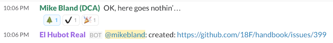

# hubot-slack-github-issues

[](https://travis-ci.org/18F/hubot-slack-github-issues)

When a [Slack](https://slack.com/) chat message receives a specific emoji reaction, this [Hubot](https://hubot.github.com/) plugin creates a [GitHub](https://github.com/) issue with a link to that message.

This plugin is for teams who use Slack to communicate and GitHub to track issues. It provides an easy way to file an issue (just add a specific emoji to a message), which helps team members quickly document or act upon important parts of conversations. For example, 18F [tags Slack messages with an evergreen tree](https://18f.gsa.gov/2015/12/08/using-emoji-for-knowledge-sharing/) when we notice future new hires should see that information.

<figure>
<br/>
<figcaption>Example of filing an issue by reacting to a message with an
evergreen_tree emoji. After successfully filing an issue, the plugin marked
the message with a heavy_check_mark emoji and posted the issue URL to the
channel.</figcaption>
</figure>

## How it works

This plugin works by registering [Hubot receive middleware](https://hubot.github.com/docs/scripting/#receive-middleware)
that listens for [Slack `reaction_added` events](https://api.slack.com/events/reaction_added).
When team members add an emoji reaction to a message, the resulting event is
matched against a set of [plugin configuration rules](#configuration).
If the event matches a rule, the plugin will [retrieve the list of
reactions](https://api.slack.com/methods/reactions.get) for the message.

If the message doesn't have an emoji reaction indicating an issue was already
filed, the plugin will [create a GitHub
issue](https://developer.github.com/v3/issues/#create-an-issue) for the
message. The issue will contain a link to the message. At this point, the
plugin will [add a reaction to the
message](https://api.slack.com/methods/reactions.add) with an emoji indicating
success. Finally, it will post the issue URL to the channel in which the
message appeared.

## Installation

Here are instructions for installing this plugin and putting it into use. If you'd like to set up a local copy for development without deploying the plugin, skip to the instructions at [Developing](#developing) (you don't need to create a Hubot instance, a Slack user, or a GitHub user until you intend to deploy the script).

1. Install [Node.js](https://nodejs.org/) on your system. This plugin requires
   version 4.2 or greater or version 5 or greater. You may wish to first install a
   version manager such as [nvm](https://github.com/creationix/nvm) to manage and install different Node.js versions.

1. [Create your own Hubot instance](https://hubot.github.com/docs/) if you
   haven't already done so. Note that you do _not_ need to install Redis to
   use this script.

1. In your Hubot repository, run:
   ```bash
   $ npm install '18f/hubot-slack#3.4.2-handle-reaction-added' \
       hubot-slack-github-issues --save
   ```
   
   **Note:** This plugin depends upon
[18F/hubot-slack#3.4.2-handle-reaction-added](https://github.com/18F/hubot-slack/tree/3.4.2-handle-reaction-added),
which in turn depends upon
[18F/node-slack-client#1.5.0-handle-reaction-added](https://github.com/18F/node-slack-client/tree/1.5.0-handle-reaction-added).
These packages are custom forks of the
[hubot-slack](https://www.npmjs.com/package/hubot-slack) and 
[slack-client](https://www.npmjs.com/package/slack-client) packages that have
had support for the [`reaction_added`
event](https://api.slack.com/events/reaction_added) patched in. When those official packages have been updated to include `reaction_added`
support, this plugin will be updated to use those packages instead of the
custom versions.

1. Include the plugin in your `external-scripts.json`.
   ```json
   [
     "hubot-slack-github-issues"
   ]
   ```
1. Set up Slack and GitHub users:

   	If you haven't done so already, create a [Slack bot
user](https://api.slack.com/bot-users). Use the bot's API token as the value
for the [`HUBOT_SLACK_TOKEN` environment variable](#environment-variables).

   	Then [create a GitHub
account](https://help.github.com/articles/signing-up-for-a-new-github-account/)
dedicated to filing issues on behalf of the script, such as
[18f-bot](https://github.com/18f-bot). If desired, add this account to your GitHub
organization. Create a [personal access
token](https://help.github.com/articles/creating-an-access-token-for-command-line-use/)
for this user and use it as the value for the [`HUBOT_GITHUB_TOKEN`
environment variable](#environment-variables).

    **If you wish to use this script with private GitHub repositories**, [add your
GitHub user as a collaborator](https://help.github.com/articles/adding-outside-collaborators-to-repositories-in-your-organization/)
with [read access](https://help.github.com/articles/repository-permission-levels-for-an-organization/)
to each repository. Alternatively, you can [add your GitHub user to a
team](https://help.github.com/articles/adding-organization-members-to-a-team/)
with access to private repositories instead.

1. Configure the plugin by [creating a JSON configuration file with these items](#configuration) and setting the [environment variables](#environment-variables).

1. Run `bin/hubot` or otherwise deploy to your preferred environment.

## Configuration

Create a JSON configuration file conforming to the following schema:

* **githubUser**: GitHub organization or username owning all repositories
* **githubTimeout**: GitHub API timeout limit in milliseconds
* **slackTimeout**: Slack API timeout limit in milliseconds
* **successReaction**: emoji used to indicate an issue was successfully filed
* **rules**: defines each condition that will result in a new GitHub issue
  * **reactionName**: name of the reaction emoji triggering the rule
  * **githubRepository**: GitHub repository belonging to *githubUser* to which
    to post issues
  * **channelNames (optional)**: name of the Slack channels triggering the
    rule; leave undefined to match messages in _any_ Slack channel

For example:

```json
{
  "githubUser": "18F",
  "githubTimeout": 5000,
  "slackTimeout": 5000,
  "successReaction": "heavy_check_mark",
  "rules": [
    {
      "reactionName": "evergreen_tree",
      "githubRepository": "handbook"
    }
  ]
}
```

This file can reside at the default path of `config/slack-github-issues.json`
within your Hubot installation, or can be specified via the
`HUBOT_SLACK_GITHUB_ISSUES_CONFIG_PATH` environment variable.

For a more complete example, see
[`test/helpers/test-config.json`](./test/helpers/test-config.json) in this
repository.

### Configuration constraints

To keep the configuration file readable, `rules:` must be sorted according to
the following ordering rules. The script will abort otherwise:

- `reactionName` in lexicographic order
- rules that do not define `channelNames` must follow any other rules for the
  same `reactionName`, so that more specific rules are matched first
- `githubRepository` in lexicographic order

To ensure that rules behave as expected, the script also enforces
following conditions for each set of rules pertaining to a `reactionName`:

- Each rule's `channelNames` list is sorted
- Each `githubRepository` value is unique
- Each value in `channelNames` is unique across every rule
- Only the last rule can leave `channelNames` undefined, as this rule will
  match messages in every channel not matched by other rules

### Environment variables

You must also set the following environment variables (how to do that depends on the operating system and shell that you use; [here's an example guide for OS X with the default bash shell](http://osxdaily.com/2015/07/28/set-enviornment-variables-mac-os-x/)):

* `HUBOT_GITHUB_TOKEN`: personal API token for the GitHub user
* `HUBOT_SLACK_TOKEN`: API token for the Slack bot user

The following environment variables are optional:
* `HUBOT_SLACK_GITHUB_ISSUES_CONFIG_PATH`: the path to the configuration file;
  defaults to `config/slack-github-issues.json`

## Developing

Install Node.js per the [installation instructions](#installation). You don't
need to create a Hubot instance, nor do you need to create Slack or GitHub
users, until you intend to deploy the script.

After cloning this repository, do the following to ensure your installation is
in a good state:

```sh
$ cd hubot-slack-github-issues
$ npm install
$ npm run lint
$ npm test
$ test/hubot-smoke-test.bash
```

After making changes, run `npm run lint` and `npm test` frequently. Add new
tests in [the `test` directory](./test/) for any new functionality, or to
reproduce any bugs you intend to fix. Run `test/hubot-smoke-test.bash`
occasionally to ensure that the script can be loaded by Hubot.

To run a subset of the tests, use the following syntax, replacing `'Config'`
with any string matching the tests you wish to run:

```sh
$ npm test -- --grep 'Config'
```

If you'd like to contribute to this repository, please follow our
[CONTRIBUTING guidelines](./CONTRIBUTING.md).

## Public domain

This project is in the worldwide [public domain](LICENSE.md). As stated in
[CONTRIBUTING](CONTRIBUTING.md):

> This project is in the public domain within the United States, and copyright
> and related rights in the work worldwide are waived through the
> [CC0 1.0 Universal public domain dedication](https://creativecommons.org/publicdomain/zero/1.0/).
>
> All contributions to this project will be released under the CC0 dedication.
> By submitting a pull request, you are agreeing to comply with this waiver of
> copyright interest.
